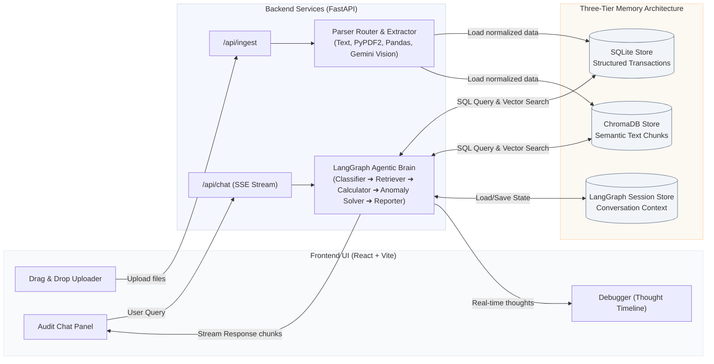

# 🧾 Resolvr — Stateful Financial Auditor

Resolvr is a production-grade, agentic financial auditing application designed to ingest, parse, and reconcile complex, unstructured, and messy financial documents (invoices, CSV spreadsheets, multi-page bank statements, and blurry receipts). 

Built as a complete full-stack RAG (Retrieval-Augmented Generation) system, Resolvr utilizes a **three-tier memory architecture** and an autonomous **ReAct reasoning loop** powered by **Gemini 3.5 Flash** (or Gemini 3.1 Flash Lite) to identify mathematical anomalies, flag duplicate transactions, and resolve OCR/parsing discrepancies automatically.

[](https://www.python.org/)
[](LICENSE)
[](#tech-stack)
[](eval/eval_report.md)

---

## 🚀 Live Demo & Visuals

* **Unified Audit Chat Panel**: A chat interface where users query the auditor in plain English (e.g. *"What is my Q3 burn rate?"* or *"Sum all software subscriptions"*).
* **Clickable Source Citations**: Every computed total or retrieved transaction includes clickable references pointing directly to the source file name, page number, and parsing confidence score.
* **Agentic Debugger Panel**: A real-time timeline visualizing the agent's internal ReAct loop:
  `Classifier (Intent) ➔ Retriever (SQL + Vector) ➔ Calculator (Decimal Math) ➔ Anomaly Detector ➔ Solver (ReAct Loop) ➔ Reporter (Cited Response)`

---

## 🏗️ System Architecture


The following Mermaid diagram outlines the high-level full-stack architecture of Resolvr:



---

## 💾 Core Technologies & Decisions

### 1. Three-Tier Memory Model
* **Structured Store (SQLite + SQLAlchemy)**: Saves normalized transactions, merchants, and dates. This allows the LLM to run precise, algebraic filter queries (e.g. `SELECT * FROM transactions WHERE date >= '2025-01-01'`) instead of relying on unreliable vector lookups for numbers.
* **Semantic Store (ChromaDB + Nomic Embed Text v1.5)**: Stores document chunks for semantic search. This handles fuzzy, conceptual queries (e.g. *"Find where we discussed hiring a woodworker"*).
* **Session Store (LangGraph SqliteSaver)**: Maintains persistent conversation states, enabling full multi-turn auditing context.

### 2. Autonomous Anomaly Resolution (ReAct Loop)
When documents contain mismatched values (e.g., invoice line items do not sum to the stated total, or scanning OCR yields characters like `1O5.OO` instead of `105.00`), the **Anomaly Detector** flags them. The **ReAct Solver** then initiates a targeted crop-and-reparse tool, feeding the document region back into Gemini Vision, updating the records programmatically upon resolution.

### 3. Floating-Point Safety (Decimal Arithmetic)
Standard floating-point calculations in JavaScript or Python introduce rounding errors (e.g. `0.1 + 0.2 = 0.30000000000000004`). Resolvr processes all financial values using Python's `Decimal` type to guarantee exact monetary totals.

---

## 📊 Chaos Evaluation Suite

To prove Resolvr's reliability on real-world chaotic files, we built a **Chaos Dataset** containing 15 highly adversarial scenarios:

* OCR character corruptions (letter `O` in total amounts)
* String-formatted numeric cells (e.g., ` $1,200.00 ` with trailing spaces)
* Multi-page bank statements
* Overlapping duplicate transactions (same merchant, same value, 2 mins apart)
* Freeform markdown diary notes
* Spreadsheet cells merged across rows
* Multi-currency transactions
* Headerless CSV logs
* Refund values (represented as negative numbers)

Running the evaluation suite runs the entire parser router, database loader, and agentic reasoning loops end-to-end.

**Current Evaluation Accuracy**: `100.0%` (15/15 Scenarios Passed)  
Read the full report at [eval/eval_report.md](eval/eval_report.md).

---

## 🛠️ Quick Start (Local Run)

### Prerequisites
* Python 3.11+ (Python 3.13 recommended)
* Node.js v18+ and `pnpm`
* Google Gemini API Key (obtain for free at [Google AI Studio](https://aistudio.google.com/))

### 1. Backend Setup
```bash
cd backend
# Create virtual environment and install dependencies
python -m venv .venv
# PowerShell activation:
.\.venv\Scripts\Activate.ps1
# CMD activation:
# .\.venv\Scripts\activate.bat
pip install -r requirements.txt

# Create .env file and add your Gemini API Key
echo GOOGLE_API_KEY=your_gemini_api_key_here > .env

# Start uvicorn server
uvicorn api.main:app --reload --host 0.0.0.0 --port 8000
```

### 2. Frontend Setup
```bash
cd ../frontend
# Install packages
pnpm install

# Start Vite development server
pnpm dev
```
Open `http://localhost:3000` to interact with the Resolvr Web Interface.

### 3. Running Evaluation Harness
Make sure your backend virtual environment is activated:
```bash
cd eval
python run_eval.py
```

### 4. Running Backend Unit Tests
Make sure your backend virtual environment is activated:
```bash
cd backend
pytest -v
```

---

## 📄 License
This project is licensed under the MIT License - see the [LICENSE](LICENSE) file for details.
